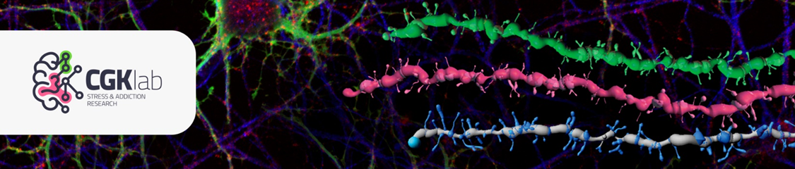

# Pycroglia

[](https://pypi.org/project/pycroglia/)
[](https://www.python.org/downloads/)
[](LICENSE)

**A Python-based toolkit for quantitative 3D morphology analysis of cells from fluorescence microscopy images.**

Originally based on the MATLAB tool **CellSelect-3DMorph**, Pycroglia reconstructs individual cells voxel-by-voxel and extracts quantitative morphological descriptors. It is built with a robust, extensible Python architecture and supports both a **PyQt6 graphical interface** and a **library mode** for automated/scripted workflows.

---

## Features

### Morphological Analysis
- **Cell volume** – Voxel-accurate 3D cell volume computation
- **Territorial volume** – Convex-hull based territorial volume and coverage statistics
- **Ramification index** – Complexity ratio comparing cell volume to territorial volume
- **Branch analysis** – Branch length (with linear, PCHIP, and spline interpolation), branch count, branch order classification (primary to quaternary), end point detection
- **Centroid analysis** – 3D centroid coordinates and mean pairwise distances in physical units
- **Convex hull metrics** – Hull volume, surface area, solidity, and compactness ratios

### Image Processing Pipeline
- **Multi-channel reader** – TIFF file format support with automatic channel extraction
- **Otsu thresholding** – Per-slice MATLAB-compatible Otsu thresholding with interactive adjustment
- **Small object removal** – Minimum-size filtering to eliminate noise artifacts
- **Morphological erosion** – Configurable 2D/3D structuring elements (disk, diamond, ball, octahedron, rectangle)
- **GMM clustering** – Gaussian Mixture Model-based nucleus separation for splitting merged cells
- **Interactive segmentation** – Per-cell segmentation with undo/rollback support

### 3D Skeletonization
- **Lee-Kashyap-Chu algorithm** – Full implementation of the 3D thinning algorithm with based Skeleton3D method used by **CellSelect-3DMorph**.
- **Scikit-image fallback** – Alternative skeletonization backend via `skimage.morphology.skeletonize`
- **Skeleton-to-graph conversion** – Convert binary skeletons to graph representations to prune short branches and back.

### Visualization & Export
- **3D rendering** – PyVista-powered visualizations: original cell surfaces, skeleton branch order coloring, end points, branch points, convex hulls
- **Geometry export** – Export skeleton surfaces, cell mask surfaces, and boolean mask volumes in **OBJ, PLY, VTP, VTK, VTI** formats
- **Results export** – Structured output to **Excel (XLSX)** and **JSON**
- **Branch lengths export** – Specialized branch-lengths XLSX output for downstream analysis

### Workflow & Performance
- **Wizard-based GUI** – Step-by-step workflow: file selection → filtering → segmentation → cell selection → analysis dashboard
- **Library mode** – Import `pycroglia.core` directly for automated batch processing
- **Parallel computation** – Qt thread pool and multiprocessing backends via a unified `Pool` facade; metrics computed concurrently via a DAG-based orchestrator
- **Interactive dashboards** – Per-file tabs throughout the pipeline, summary tables, per-cell viewers, and graph preview before export

---

## Installation

### Option 1 — Standalone Executables (No Python Installation Required)

For a quick setup without installing Python or any dependencies, you can download standalone pre-compiled executables from the [Latest Release](https://github.com/CGK-Laboratory/pycroglia/releases/latest):

1. Go to the [Releases](https://github.com/CGK-Laboratory/pycroglia/releases) page.
2. In the **Assets** section of the latest release, download the file matching your operating system:
   - **Windows**: Download `pycroglia-windows.exe` and double-click to run.
   - **macOS**: Download `pycroglia-macos.zip`, extract it to get `Pycroglia.app`, and run it. *(Note: Since the app is not signed, you may need to right-click it, select **Open**, and confirm).*
   - **Linux**: Download `pycroglia-linux`, make it executable, and run it via terminal:
     ```bash
     chmod +x pycroglia-linux
     ./pycroglia-linux
     ```

### Option 2 — Run using uvx

#### Prerequisites

- [uv](https://docs.astral.sh/uv/getting-started/installation/)

#### Install/Update and Run

```bash
uvx pycroglia
```

### Option 3 — Install with pip

- **Python 3.11 or later**
- pip

```bash
pip install pycroglia
pycroglia
```

### Option 4 — From source

```bash
git clone https://github.com/CGK-Laboratory/pycroglia.git
cd pycroglia
uv run python -m pycroglia
```

Run the test suite:
```bash
uv run pytest
```

### Jupyter Notebook

Launch a notebook server connected to the project environment:

```bash
uv run --with jupyter jupyter lab
```

---

## Usage

### GUI Mode

Launch the application and follow the wizard:

1. **File Selection** – Select TIFF or LSM image files
2. **Filter Editor** – Adjust Otsu threshold per slice, remove small objects, configure erosion
3. **Segmentation Editor** – View labeled cells by size, split merged cells via GMM
4. **Cell Selection** – Filter cells by size, remove border cells, preview selections
5. **Results Dashboard** – Set physical scale, compute all metrics, preview 3D visualizations, export results

---

## Documentation

Full documentation is available at [CGK-Laboratory.github.io/pycroglia](https://CGK-Laboratory.github.io/pycroglia) (or locally via `docs/`).


---

## Contributing

We welcome contributions! Please see [CONTRIBUTING.md](docs/CONTRIBUTING.md) for guidelines.

---

## License

This project is licensed under the MIT License — see the [LICENSE](LICENSE) file for details.
